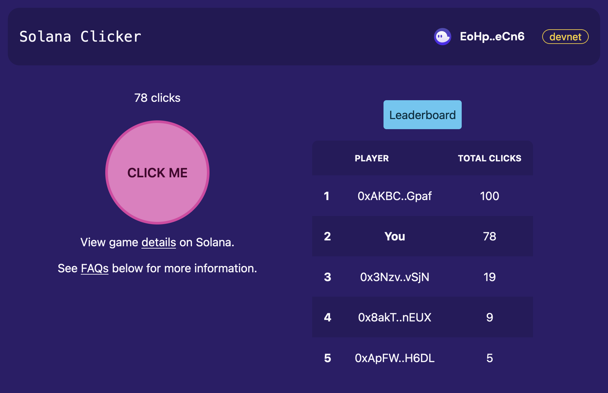

# solana-clicker-game

An open-source web-based Clicker style game running on the Solana blockchain.

Solana wallet support has only been tested on desktop web browsers.

## Tools and Frameworks

- [Next.js](https://nextjs.org/) with TypeScript
- [tailwindcss](https://tailwindcss.com/)
- [daisyUI](https://daisyui.com)
- [Solana Wallet Adapter](https://github.com/solana-labs/wallet-adapter)
- [Anchor framework for Solana](https://book.anchor-lang.com/)

## Running locally

- See [web-ui/README.md](web-ui/README.md) to run the web frontend.
- See [program/README.md](program/README.md) to run, test and deploy the Solana program.
